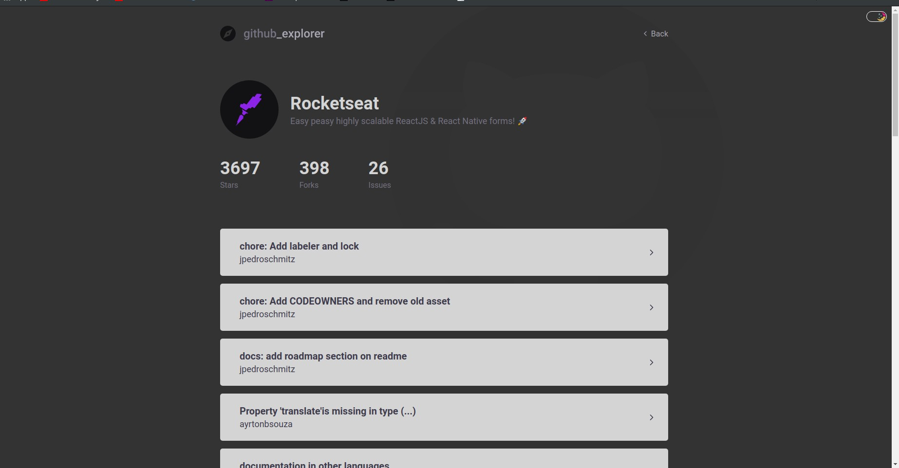

# Github Explorer

Search for Github repositories and list that repositories issues.

Keep track of the repositories searched.

---

### Switch Themes

Choose between a light theme (it's the default) or dark theme.

The choosen theme persists between session

---

### Technologies

- React.js:

  - React Hooks
  - Styled Components

- Github API
